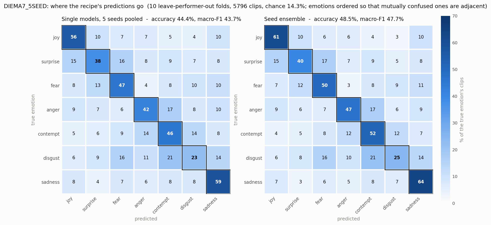

# diema-stgcn-benchmark

[](pyproject.toml)
[](https://github.com/VictorS-67/diema-stgcn-benchmark/actions/workflows/test.yml)
[](LICENSE)


A reproducible ST-GCN baseline for **emotion recognition from motion capture**, on the [DIEM-A corpus](https://www.cr-ict.riec.tohoku.ac.jp/diem-a/). Performers act out emotions in a mocap suit; the model reads the skeleton and names the emotion.

This repository is a **complete path from raw BVH files to a number you can put in a table**, and a starting point for your own work. Everything is driven by one YAML config, the evaluation protocol is leave-performer-out so a result means "on people the model has never seen", and the recommended settings are the outcome of a tuning campaign rather than defaults inherited from another dataset.

BVH parsing, forward kinematics, tensor packing and the augmentation pipeline all come from [pybvh](https://victors-67.github.io/pybvh/) and [pybvh-ml](https://victors-67.github.io/pybvh-ml/), two companion libraries that are useful on their own for BVH work.

---

## What you get

Running the recipe as it ships reproduces this:

| task | classes | chance | single model | 5-seed ensemble |
|---|---|---|---|---|
| **DIEMA-7** | 7 emotions | 14.3% | **44.4%** | **48.5%** |
| **DIEMA-13** | 13 labels incl. neutral | 7.7% | **33.5%** | **36.5%** |

Leave-performer-out over 10 folds, averaged over 5 seeds for the 7-emotion task and 3 for the 13-label one, reported at the final epoch. Validation accuracy tracks test within a third of a point in both cases.

> ⚠️ **Read these as a baseline to reproduce, not as an unbiased estimate.** The recipe was selected by a campaign that scored these same test folds many times, so the test column carries selection optimism. Measured against validation it comes to **0.35 points** and is not distinguishable from zero; the part that no split inside this corpus can see is bounded at **about 2 points**, a worst case the campaign's own effect sizes argue against. See [RESULTS.md](RESULTS.md) for both derivations, why re-shuffling the folds would not fix it, and the full per-emotion and confusion-matrix breakdown for both tasks.



*Emotions are ordered so that mutually confused ones sit next to each other, which makes the structure visible as blocks on the diagonal. Anger, contempt and disgust form one; surprise and fear another.*

---

## 1. Install, and check it works before you have any data

```bash
conda create -n diema python=3.11 && conda activate diema
pip install -e ".[dev]"
make test
```

The test suite needs **no dataset and no GPU** and finishes in about fifteen seconds. Run it first: it confirms the install while your dataset request is still in someone's inbox.

```
252 passed in 4.45s
```

**Where it runs.** The test suite runs on Linux, macOS and Windows, and CI checks all three; on Windows, which has no `make`, run `python -m pytest tests/ -m "not slow" -q`. Training is narrower. The recipe trains in `bf16-mixed`, which needs an NVIDIA GPU, Ampere or newer. Without CUDA it falls back to full precision with a warning, which is no longer the configuration the table measured, and 400 epochs over ten folds is out of reach of a CPU anyway. `scripts/run_lpo.sh` is a bash script, so on Windows run it under WSL.

**Matching the measured environment.** The install above takes the newest release of every dependency, which is what you want for building on this code. The table was measured on Linux with one RTX 4090, Python 3.11, torch 2.7.1 on CUDA 12.8 and pytorch-lightning 2.6.1. To reproduce it, install against those pinned versions instead:

```bash
conda create -n diema python=3.11 && conda activate diema
pip install torch==2.7.1 --index-url https://download.pytorch.org/whl/cu128
pip install -e ".[dev]" -c constraints.txt
```

[constraints.txt](constraints.txt) pins every package in that environment's dependency tree, and CI installs it on every push so it keeps resolving. Even in a matching environment, GPU kernels are not bitwise deterministic, so expect results within the seed-noise ranges in section 7, not identical digits.


## 2. Get the data

DIEM-A is released for **research use only** and is not redistributed here. Request it from the authors at <https://www.cr-ict.riec.tohoku.ac.jp/diem-a/>.

Put the BVH tree wherever you like and point `data/` at it, or use a symlink:

```bash
ln -s /path/to/diema data
```

The corpus ships one directory per performer. File names encode everything the pipeline needs:

```
JP_06_anger_1_H
│  │  │     │ └── intensity: High / Medium / Low
│  │  │     └──── scenario
│  │  └────────── emotion
└──┴───────────── performer, nationality and id
```

The performer id is what the evaluation protocol splits on, so it matters that it parses correctly.

## 3. Preprocess

One command turns the BVH tree into a single array file.

```bash
emo-preprocess \
    --input data/raw/diema-bvh --output data/processed/diema7_quat_pos.npz \
    --recursive \
    --target-fps 30 \
    --target-world-up +z --target-rest-forward +y --target-rest-up +z \
    --include-positions --position-space joint --position-centering skeleton \
    --emo2idx configs/emo_to_idx_7.txt
```

Every flag earns its place:

| flag | why |
|---|---|
| `--output` | decide the output of the preprocessed data. We use `diema7_quat_pos.npz`  for the 7-emotion task and `diema13_quat_pos.npz` for all 13 |
| `--recursive` | DIEM-A nests one directory per performer. **Without this the glob matches nothing, and the command exits successfully having done nothing.** |
| `--target-fps 30` | the corpus is 120 Hz; 30 is what the recipe is measured at, and a mismatch silently changes what a 100-frame clip covers |
| `--target-world-up +z` and the two rest-axis flags | DIEM-A is Z-up. Getting this wrong makes "rotate about vertical" tip the performer over |
| `--include-positions --position-space joint` | the recipe feeds joint positions alongside rotations, and they have to be in the file |
| `--position-centering skeleton` | removes the global trajectory so the model reads posture, not where in the room somebody stood |
| `--emo2idx` | fixes the label ordering. Use `emo_to_idx_7.txt` for the 7-emotion task and `emo_to_idx.txt` for all 13 |

**Check before moving on.** The command reports how many clips it wrote. Expect **5,796** for the seven-emotion task and **10,212** for all thirteen. If you got zero, you left out `--recursive`. If the count is right but training later complains that position streams are missing, you left out `--include-positions`.

## 4. Understand how the evaluation works

This is the part worth reading twice, because it is what makes every number afterwards mean something.

**Leave-performer-out.** The 92 performers are divided into 10 groups. For fold *k*, group *k* is the test set, group *k+1* is validation, and the remaining eight groups are training. So the model is always scored on **people it has never seen** — not on unseen clips from people it has memorised.

Two consequences you have to design around:

- **A single fold tells you almost nothing.** One fold is nine performers, and performers vary enormously: individual accuracy on this corpus runs from 21% to 60%. A single fold moves by about 2.7 points depending on who is in it, while the ten-fold mean moves by a tenth. Always run all ten.
- **A single seed tells you less than you think.** Run-to-run variation is about 0.7 points, so a difference below roughly 1.9 points at one seed has not been shown to exist. If you are comparing two settings, use three seeds and check that test and validation agree.

Splits are built deterministically from the data file, so `--fold 3 --num-folds 10` gives everyone the same partition and no split files need sharing.

## 5. Configure

One YAML fully specifies an experiment. `configs/diema7_stgcn_recipe.yaml` is the recommended one and its header explains what each block is doing.

```yaml
data:
  streams: [joint_rot, root_pos, joint_pos, joint_vel, joint_acc]  # 15 channels
  clip_length: 100          # 100 frames at 30 Hz = 3.3 s
  scale_normalize: false
model:
  type: stgcn
  in_channels: 15
  num_class: 7
  base_channels: 64         # the 64/128/256 ladder
  plusplus: false           # temporal block, see below
  edge_weighting: importance
training:
  base_lr: 0.1              # SGD, momentum 0.9, nesterov
  weight_decay: 0.0005
  max_epochs: 400           # cosine anneal
  batch_size: 64
  label_smoothing: 0.0
augmentation:
  mirror: true              # and nothing else
  rotate: false
  speed: false
  noise_sigma: 0
  dropout: false
```

The three choices most likely to surprise you:

- **Feed rotations and positions together.** Positions are a deterministic function of rotations, so they add no information, and supplying them anyway is worth about 3.6 points. The network cannot cheaply perform its own forward kinematics through local graph convolutions, so you hand it the result.
- **Mirror only.** Rotation noise is applied in rotation space, where forward kinematics amplifies it: a small jitter at the shoulder is a large displacement at the hand. On position channels it costs several points and stops the network fitting its training set at all. An augmentation pipeline is a property of a dataset *in a representation*, not of a dataset.
- **Report the final epoch, not the best validation checkpoint.** Selecting on validation measures slightly worse here, and fixing the rule in advance is what stops the number drifting upward with every look.

Anything can be overridden without editing the file if you want:

```bash
emo-train --config configs/diema7_stgcn_recipe.yaml --fold 1 --num-folds 10 \
    --override training.max_epochs=50 model.base_channels=32
```

## 6. Train all ten folds

```bash
scripts/run_lpo.sh
```

That trains every fold for one seed, scores them together and prints the result. It is **resumable**: a fold whose checkpoint already exists is skipped, so interrupting it costs you only the fold in flight. It scores only once all ten folds are present, so a partial run never produces a misleading number.

```bash
SEED=1 scripts/run_lpo.sh                                  # another seed
CONFIG=configs/diema13_stgcn_recipe.yaml scripts/run_lpo.sh  # all 13 labels
EXTRA="model.plusplus=true" scripts/run_lpo.sh             # the STGCN++ block
UNTIL=08:00 scripts/run_lpo.sh                             # stop at a wall-clock time
nohup setsid scripts/run_lpo.sh > run.log 2>&1 &           # detached (on macOS, drop setsid)
```

**Cost.** About 18 minutes per fold on one RTX 4090, so roughly 3 hours per seed for the seven-emotion task and about twice that for all thirteen.

## 7. Read the result

The runner prints this when it finishes. This is one seed, ten folds:

```
  test   45.13%   (folds 41.5 to 48.0)
  val    44.11%
  train  99.92%   <- below ~99.9 means the run did not finish fitting
```

That is seed 255, which is what `scripts/run_lpo.sh` uses unless you set `SEED`, so it is what the command above prints on a first run. Its 45.13% is one of the five seed means behind the table at the top of this page: 43.60, 43.60, 44.34, **45.13** and 45.25, whose mean is the 44.4% quoted there. **A single run is one draw from that spread, not a reproduction of the mean.**

Four checks, in order of how often they catch something:

1. **Training accuracy near 99.9%.** Test accuracy on this task is won in the final stretch of fitting the training set. A run that stalls below that has not finished, and comparing its endpoint against a run that did is meaningless. This catches most misconfigurations, and a stalled run almost always means an augmentation problem.
2. **Test and validation close together.** They are two disjoint groups of unseen performers, so both estimate the same thing and a real effect moves both. The gap between them has a spread of about 0.7 points and exceeds one point in roughly one run in five, so a single wide gap is normal. What is worth investigating is a gap that persists in the same direction across seeds.
3. **The fold spread.** One seed spans six to eight points, and across seeds folds have run from 39.9% to 49.9%. Fold means have a standard deviation of 2.1 points against 0.7 for the ten-fold average, so this is performer difficulty, not instability, and the ten-fold average is the only thing worth comparing.
4. **The mean against the table above.** Seed noise alone is 0.69 points, so how close you should land depends on how many seeds you averaged.

   | seeds averaged | lands within, 19 times out of 20 |
   |---|---|
   | 1 | ±1.4 points of 44.4% |
   | 3 | ±0.8 |
   | 5 | ±0.6 |

   Outside that band something differs in the setup, and the training-accuracy column is the first thing to check.

For per-emotion numbers and the confusion matrix:

```bash
python scripts/per_class_analysis.py \
    --config configs/diema7_stgcn_recipe.yaml \
    --logs runs/diema7_stgcn_recipe/seed255 --variants recipe \
    --labels configs/emo_to_idx_7.txt --out runs/per_class.json
```

**The cheapest four points available.** Train the same recipe at several seeds and average their predicted probabilities. It costs no extra training and is worth more than any single change in the recipe. Cache each seed with `scripts/collect_predictions.py`, then combine with `emo-ensemble`. The exact commands are in [RESULTS.md](RESULTS.md).

## 8. Going further

**Switch the temporal block.** Each ST-GCN layer ends in a temporal convolution over 9 frames. Setting `model.plusplus: true` replaces it with the STGCN++ multi-branch unit: six parallel branches, a 1x1 convolution, a max-pool, and four dilated 3-frame convolutions, concatenated and fused. It sees further in time and, because the branches split the channels, uses fewer parameters (1.4 M against 3.1 M).

> **Not measured on this task yet.** Every number in this README comes from the basic block, which is what `model.plusplus` defaults to, so a config of your own that says nothing about the temporal block gets it. The multi-branch block is supported, tested, and unevaluated here; we intend to add it to the comparison once the basic-block pipeline is finished.

**Change the capacity.** `model.base_channels` scales the whole ladder from one key: 32 gives 0.8 M parameters, the default 64 gives 3.1 M, 128 gives 12 M. Those are basic-block figures; with `plusplus: true` the same three widths give 0.37 M, 1.4 M and 5.5 M.

**Add your own model.** Subclass `BaseModel`, take input shaped `(batch, channels, frames, joints)`, return `{"logits": tensor}`, and register it with `register_model("my_model")`. Point `model.type` at the name. Nothing in the training loop, the data pipeline or the CLI needs to change. Put it in its own package under `emo_mocap/models/` and do not import across model packages, so that a future project can take yours and leave the rest.

**The other commands.** `emo-predict` writes per-clip probabilities to CSV, `emo-ensemble` combines several of those, `emo-generate-splits` writes fold assignments to disk if you need to share an exact partition, and `emo-evaluate` scores a checkpoint against a split file. All take `--help`.

---

## Citing this

If you use this repository, please cite the DIEM-A dataset paper and the architecture papers listed in [NOTICE](NOTICE), which also records the upstream implementations this code follows.

## Licence

Apache-2.0, see [LICENSE](LICENSE) and [NOTICE](NOTICE). The DIEM-A corpus is **not** covered by it: the dataset is research-licensed by its authors and is not distributed here.
