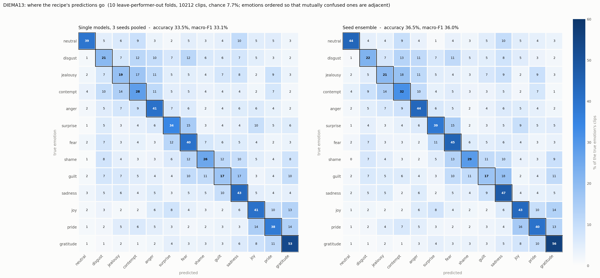

# Results

Two tasks, one recipe, nothing re-tuned between them. Every number here comes
from `configs/diema7_stgcn_recipe.yaml` and `configs/diema13_stgcn_recipe.yaml`
exactly as they ship, trained with `scripts/run_lpo.sh`.

## How to read these numbers

> **These are a baseline to reproduce, not an unbiased estimate.** The recipe
> was chosen by a tuning campaign that scored these same ten test folds many
> times over, so the test column carries selection optimism that cannot be
> measured from inside the same folds.
>
> Two things bound how large that is. **Validation** is a separate, equally
> held-out group of performers, used during the campaign only as an agreement
> check rather than as the thing being optimised, and it tracks test to within
> a third of a point. And the **13-label numbers are cleaner still**: the
> recipe was carried over to that task with nothing re-tuned, so no
> hyperparameter was ever selected on those folds.
>
> Re-shuffling which performers land in which fold would not fix this. Every
> performer is tested exactly once whichever grouping you use, so the ten-fold
> mean moves by about 0.04 points across re-groupings while any single fold
> moves by 2.7. The selection used these 92 people either way. The only real
> fix is a group of performers held out before tuning begins and scored once
> at the end, which is what we would advise for any new campaign.
>
> Quote the mean over seeds with the validation column beside it, and say how
> the configuration was chosen.

**Protocol.** Leave-performer-out, 10 folds. Test is one group of performers,
validation is the next group, training is the rest, so both held-out splits
are people the model has never seen. Accuracy and macro-F1 are computed per
fold, then averaged over folds, then over seeds. Per-class figures and
confusion matrices are pooled over folds and seeds. The reported checkpoint is
the final epoch, fixed in advance. Balanced accuracy is the mean of per-class
recalls, which matters for the 13-label task where `neutral` is under-sampled.

---

## DIEMA-7: seven emotions

5,796 clips, 92 performers, 10 folds, 5 seeds. Chance is 14.3% and the largest
class is also 14.3%, so the corpus is balanced.

| model | test acc | test macro-F1 | val acc | balanced acc |
|---|---|---|---|---|
| single model, mean of 5 seeds | **44.38** ± 0.79 | 43.69 ± 0.82 | 44.10 ± 0.24 | 44.39 |
| ensemble of the 5 seeds | **48.50** | 47.66 | — | 48.50 |

That is 3.1 times chance for a single model and 3.4 times for the ensemble.
Averaging the five seeds' probabilities costs no extra training and is worth
4.1 points, which is more than any single change in the recipe.

Per-seed test accuracy runs 43.60, 43.60, 44.34, 45.13, 45.25. The spread on
validation is a quarter of a point, so the pipeline is stable; the wider test
spread is fold-difficulty noise, not instability.

Training accuracy is 99.93%. A run of this recipe that lands materially below
that has not finished fitting, and its test number is not comparable.

### Per emotion

| emotion | clips | recall | precision | F1 | recall (ensemble) | F1 (ensemble) |
|---|---|---|---|---|---|---|
| anger | 828 | 42.5 | 46.4 | 44.4 | 47.2 | 49.7 |
| contempt | 828 | 45.9 | 40.4 | 43.0 | 52.1 | 47.7 |
| disgust | 828 | 22.8 | 30.8 | 26.2 | 24.8 | 29.8 |
| fear | 828 | 46.7 | 43.3 | 45.0 | 50.0 | 47.8 |
| joy | 828 | 56.3 | 52.6 | 54.4 | 61.0 | 58.3 |
| sadness | 828 | 59.0 | 49.6 | 53.9 | 64.1 | 57.7 |
| surprise | 828 | 37.5 | 43.1 | 40.1 | 40.3 | 43.7 |

`sadness` and `joy` are recognised best, `disgust` worst by a wide margin at
22.8% recall, which is still 1.6 times chance. No emotion is unlearned.


### Confusion matrix

Row percentages, true emotion in rows, single models pooled over seeds.

| true \ predicted | joy | surpr | fear | anger | conte | disgu | sadne |
|---|---|---|---|---|---|---|---|
| joy | **56.3** | 10.4 | 7.3 | 6.9 | 5.1 | 4.4 | 9.6 |
| surprise | 15.2 | **37.5** | 15.8 | 7.6 | 8.8 | 7.3 | 7.8 |
| fear | 7.9 | 13.1 | **46.7** | 4.2 | 8.0 | 9.7 | 10.5 |
| anger | 8.9 | 7.5 | 6.3 | **42.5** | 16.8 | 8.0 | 10.0 |
| contempt | 4.9 | 5.7 | 8.5 | 13.6 | **45.9** | 13.8 | 7.7 |
| disgust | 6.4 | 8.9 | 15.8 | 10.6 | 21.0 | **22.8** | 14.4 |
| sadness | 7.6 | 4.1 | 7.4 | 6.2 | 7.9 | 7.8 | **59.0** |

**Emotions are ordered by clustering the confusion matrix**, using average
linkage with optimal leaf ordering on the symmetrised row percentages, so
mutually confused emotions sit next to each other and the structure shows up
as blocks on the diagonal rather than scattered off it.

Two blocks stand out. `anger`, `contempt` and `disgust` trade errors heavily,
with `disgust` sending 21% of its clips to `contempt`. And `surprise` and
`fear` exchange 13 to 16% each way. `sadness` is the most self-contained
class. The pattern is consistent with arousal separating better than valence,
which is an interpretation of the figure rather than a tested claim.

---

## DIEMA-13: all thirteen labels

10,212 clips, the same 92 performers and the same fold assignment, plus
`neutral` and five further emotions. 3 seeds. Chance is 7.7%. `neutral` has
276 clips against 828 for every other label, so read balanced accuracy beside
plain accuracy.

| model | test acc | test macro-F1 | val acc | balanced acc |
|---|---|---|---|---|
| single model, mean of 3 seeds | **33.52** ± 0.10 | 33.12 ± 0.10 | 33.46 ± 0.33 | 33.85 |
| ensemble of the 3 seeds | **36.46** | 35.95 | — | 36.85 |

Accuracy falls against the seven-emotion task but the multiple of chance
rises, from 3.1 to 4.4 for a single model. The seed spread is a tenth of a
point, an order of magnitude tighter than on DIEMA-7. Training accuracy is
99.89% on every seed. `neutral` reaches 39.5% recall from a third of the data
of any other class, so the under-sampled label is not being ignored.

### Per emotion

| emotion | clips | recall | precision | F1 | recall (ensemble) | F1 (ensemble) |
|---|---|---|---|---|---|---|
| anger | 828 | 40.7 | 37.5 | 39.0 | 43.6 | 41.6 |
| contempt | 828 | 27.9 | 28.5 | 28.2 | 31.9 | 31.8 |
| disgust | 828 | 20.8 | 24.8 | 22.6 | 22.3 | 25.2 |
| fear | 828 | 40.5 | 33.3 | 36.5 | 45.2 | 40.4 |
| joy | 828 | 40.6 | 38.3 | 39.4 | 43.0 | 41.6 |
| sadness | 828 | 43.0 | 35.0 | 38.6 | 47.5 | 40.9 |
| surprise | 828 | 34.5 | 35.0 | 34.7 | 38.6 | 39.2 |
| neutral | 276 | 39.5 | 38.7 | 39.1 | 43.8 | 43.1 |
| jealousy | 828 | 18.6 | 23.0 | 20.5 | 20.5 | 23.0 |
| shame | 828 | 25.6 | 33.2 | 28.9 | 28.9 | 33.4 |
| guilt | 828 | 17.3 | 21.9 | 19.4 | 17.4 | 20.2 |
| gratitude | 828 | 53.3 | 43.9 | 48.1 | 56.0 | 49.9 |
| pride | 828 | 37.9 | 37.2 | 37.5 | 40.3 | 39.6 |

`gratitude` is the best-recognised label in the whole corpus at 53.3% recall.
`guilt` and `jealousy` are the weakest at 17.3 and 18.6, below `disgust`. Of
the seven original emotions, `anger`, `disgust` and `surprise` lose only 2 to
4 points of recall against six new competitors, while `contempt`, `joy` and
`sadness` each lose 16 to 17. The confusion matrix shows where they went.



### Confusion matrix

Row percentages, true emotion in rows, single models pooled over seeds.

| true \ predicted | neutr | disgu | jealo | conte | anger | surpr | fear | shame | guilt | sadne | joy | pride | grati |
|---|---|---|---|---|---|---|---|---|---|---|---|---|---|
| neutral | **39.5** | 4.6 | 6.3 | 9.2 | 3.1 | 1.8 | 4.6 | 3.4 | 4.3 | 10.4 | 5.1 | 5.2 | 2.5 |
| disgust | 1.5 | **20.8** | 7.0 | 11.8 | 10.3 | 6.8 | 11.9 | 6.5 | 5.8 | 7.4 | 4.8 | 3.1 | 2.2 |
| jealousy | 2.2 | 7.2 | **18.6** | 17.3 | 11.2 | 4.8 | 4.8 | 4.0 | 7.3 | 8.1 | 2.5 | 8.8 | 3.1 |
| contempt | 3.7 | 10.1 | 14.2 | **27.9** | 11.1 | 4.7 | 5.3 | 3.7 | 4.0 | 4.3 | 2.1 | 7.1 | 1.9 |
| anger | 1.8 | 5.3 | 7.3 | 9.0 | **40.7** | 6.6 | 5.7 | 2.4 | 3.8 | 5.5 | 5.7 | 3.9 | 2.3 |
| surprise | 0.9 | 5.4 | 3.0 | 4.3 | 6.3 | **34.5** | 15.2 | 2.7 | 3.6 | 4.2 | 9.5 | 4.9 | 5.5 |
| fear | 2.2 | 7.5 | 3.4 | 3.9 | 2.7 | 12.2 | **40.5** | 7.0 | 5.5 | 5.4 | 4.2 | 2.5 | 3.1 |
| shame | 0.7 | 7.9 | 4.4 | 2.5 | 2.9 | 6.1 | 12.0 | **25.6** | 11.5 | 9.7 | 4.9 | 3.5 | 8.3 |
| guilt | 1.5 | 7.3 | 6.7 | 5.0 | 4.4 | 3.6 | 10.4 | 10.6 | **17.3** | 16.6 | 2.6 | 4.1 | 9.9 |
| sadness | 2.6 | 4.5 | 5.6 | 3.7 | 5.4 | 2.7 | 4.9 | 5.0 | 9.8 | **43.0** | 4.5 | 3.8 | 4.4 |
| joy | 1.6 | 3.0 | 1.6 | 1.9 | 5.6 | 8.1 | 4.0 | 2.8 | 2.4 | 5.9 | **40.6** | 9.7 | 12.9 |
| pride | 1.4 | 2.1 | 5.3 | 6.2 | 4.7 | 3.4 | 2.1 | 2.4 | 3.1 | 3.3 | 14.4 | **37.9** | 13.8 |
| gratitude | 0.6 | 1.2 | 1.7 | 1.4 | 2.3 | 4.3 | 3.1 | 3.3 | 3.3 | 6.0 | 8.5 | 10.8 | **53.3** |

In cluster order the thirteen labels fall into four blocks on the diagonal:

- `disgust`, `jealousy`, `contempt`, `anger` — the negative cluster from the
  seven-emotion task, with `jealousy` joining it. `contempt` and `jealousy`
  exchange 14 to 17% of their clips.
- `surprise` and `fear` — the same pair as before.
- `shame`, `guilt`, `sadness` — a new low-arousal negative block. `guilt`
  goes to `sadness` 17% of the time, and this is where `sadness` lost its
  recall.
- `joy`, `pride`, `gratitude` — a positive block. `joy` moved out of its old
  neighbourhood as soon as it had positive neighbours.

The positive block is nearly sealed off from the negative ones, with at most
6% leakage either way. `neutral` sits between the low-arousal negatives and is
confused mainly with `sadness` and `contempt`. Read this as valence
separating the blocks and arousal ordering within them, but note that this is
a reading of the figure, not a hypothesis anyone tested.

---

## Reproducing these numbers

```bash
# seven emotions, one seed, about 3 hours on one RTX 4090
scripts/run_lpo.sh

# the other four seeds
for s in 1 2 3 4; do SEED=$s scripts/run_lpo.sh; done

# all thirteen labels
CONFIG=configs/diema13_stgcn_recipe.yaml scripts/run_lpo.sh

# per-emotion figures and the confusion matrix for one seed
python scripts/per_class_analysis.py \
    --config configs/diema7_stgcn_recipe.yaml \
    --logs runs/diema7_stgcn_recipe/seed255 --variants recipe \
    --labels configs/emo_to_idx_7.txt --out runs/per_class.json

# the seed ensemble: cache each seed's probabilities, then average them
for s in 255 1 2 3 4; do
  python scripts/collect_predictions.py \
      --config configs/diema7_stgcn_recipe.yaml \
      --logs runs/diema7_stgcn_recipe/seed$s --variants recipe \
      --tag seed$s --out-dir runs/predictions --override data.seed=$s
done
```

Expect your own numbers to differ by a few tenths. Fold assignment and seeding
are deterministic, but GPU kernel non-determinism means bitwise reproduction is
not guaranteed. A gap larger than about a point means something differs in the
setup, and the first thing to check is the training accuracy column.
